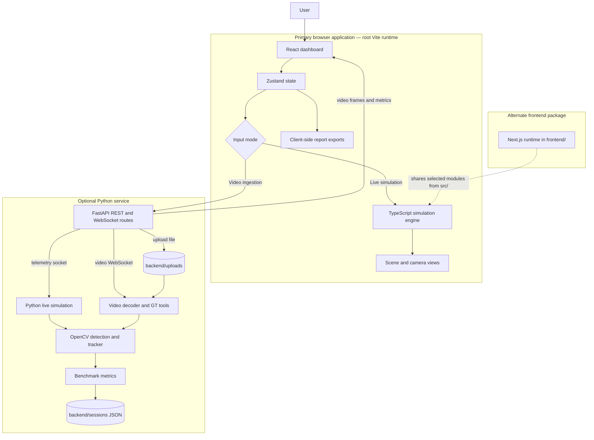
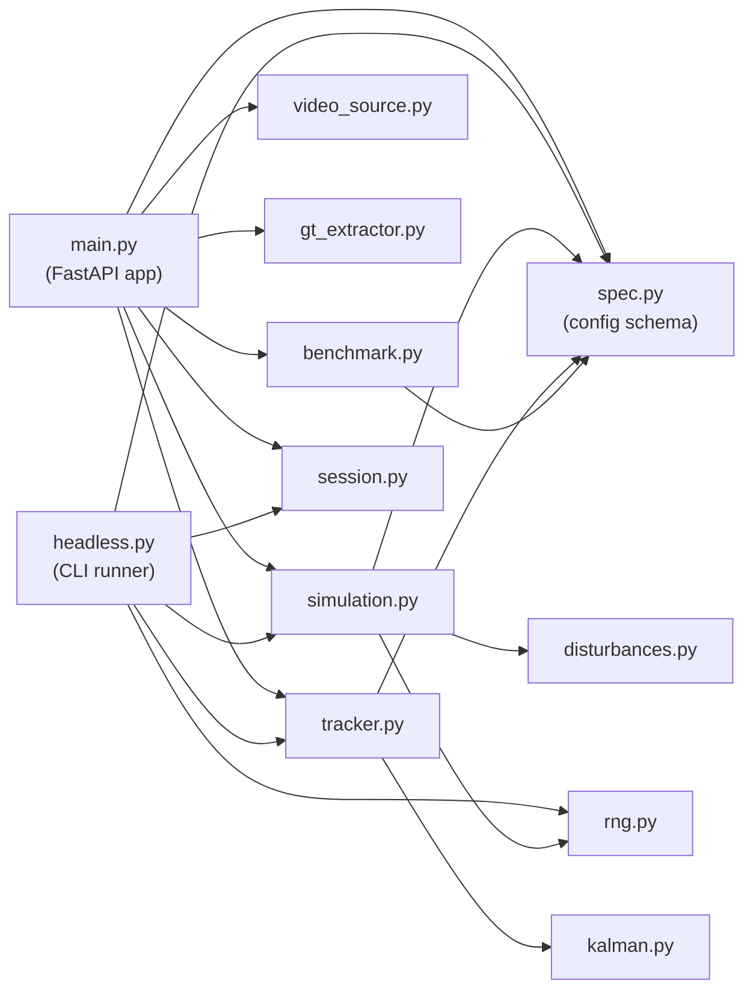
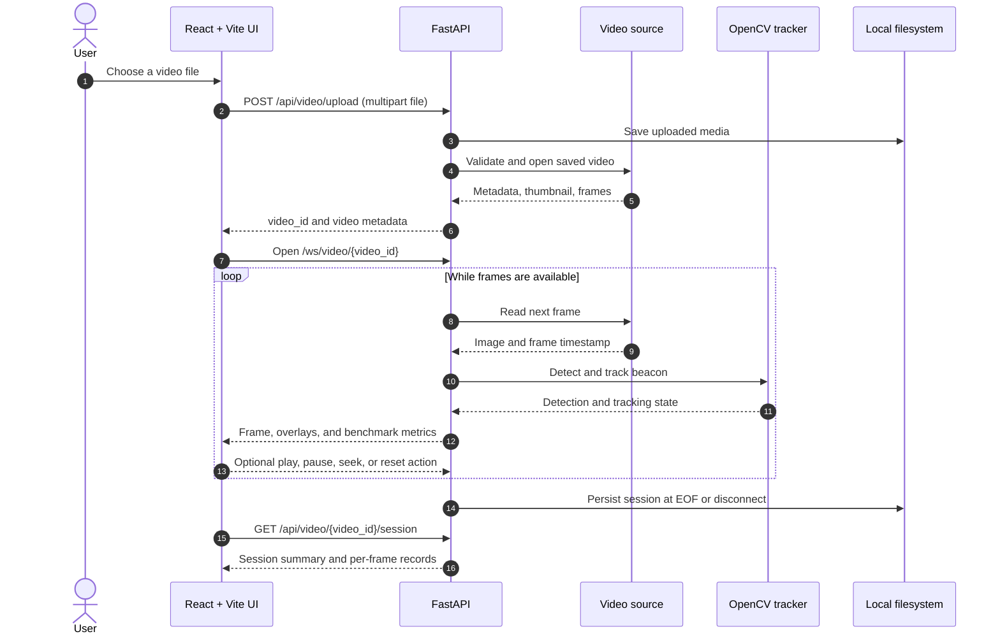
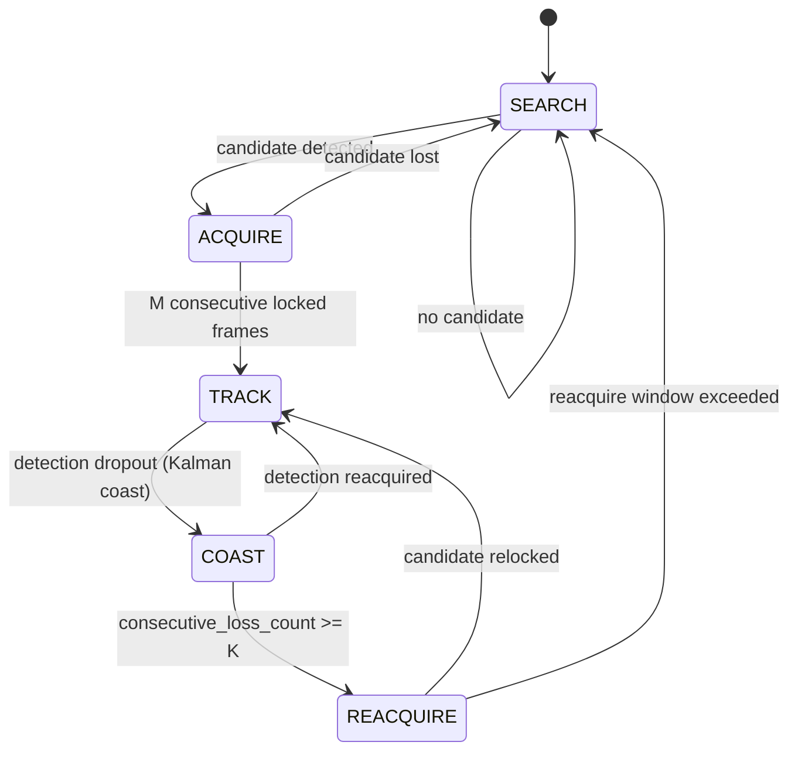
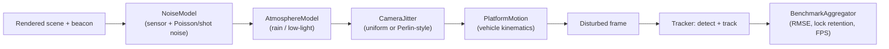

# 🛰️ AI-Based Virtual Camera Tracking System for Coarse Alignment of Mobile FSOC Terminals


> A software testbed for coarse beacon acquisition and camera-tracking workflows in free-space optical communication (FSOC). Built as an entry for **Smart India Hackathon 2024**, under a Department of Space / ISRO problem statement — this is project documentation only, not an endorsement or certification by those organizations.

**Quick start:**
```bash
npm ci
npm run dev
```
Open **http://localhost:3000**. The browser-based live simulation runs standalone and does not require the Python backend.

---

## Contents

- [Overview](#overview)
- [Key Features](#key-features)
- [Tech Stack](#tech-stack)
- [Diagrams](#diagrams)
  - [System Architecture](#system-architecture)
  - [Repository File Architecture](#repository-file-architecture)
  - [Backend Module Dependencies](#backend-module-dependencies)
  - [Video Benchmark Sequence](#video-benchmark-sequence)
  - [Tracker Lock-State Machine](#tracker-lock-state-machine)
  - [Simulation & Disturbance Pipeline](#simulation--disturbance-pipeline)
- [Project Structure](#project-structure)
- [Prerequisites](#prerequisites)
- [Installation](#installation)
- [Environment Variables](#environment-variables)
- [Running the Project](#running-the-project)
- [Usage Guide](#usage-guide)
- [API Documentation](#api-documentation)
- [Database](#database)
- [Authentication & Security](#authentication--security)
- [Scripts / Commands](#scripts--commands)
- [Testing](#testing)
- [Documentation](#documentation)
- [Deployment](#deployment)
- [Troubleshooting](#troubleshooting)
- [Limitations](#limitations)
- [Roadmap](#roadmap)
- [Contributing](#contributing)
- [License](#license)
- [Author](#author)
- [Acknowledgements](#acknowledgements)

---

## Overview

FSOC terminals use narrow optical beams and require accurate pointing, acquisition, and tracking (PAT). This project provides a virtual environment to configure a moving beacon and camera, introduce disturbances, visualize tracking behavior, and evaluate image-based detections against ground truth.

The repository contains **two frontend runtimes and one Python backend**:

- The root **React + Vite** app runs a browser-side live simulation and dashboard — no backend required.
- The **FastAPI** service provides Python simulation/telemetry over WebSocket, configuration endpoints, video ingestion, ground-truth tooling, and benchmark-session persistence.
- A separate **Next.js** app in `frontend/` shares selected UI and simulation modules from `src/`, but is not the primary runtime.

These are related but distinct: the root live simulation runs entirely client-side, while backend video evaluation uses the Python OpenCV tracker. The video-ingestion UI can use the backend when running; without it, the UI's synthetic demo path is generated in-browser and should **not** be read as measurements from an actual uploaded video.

> **Note on origin:** the root frontend was scaffolded via Google AI Studio (confirmed by AI-Studio-specific build tooling in `vite.config.ts` and `metadata.json`). This explains why `@google/genai` and `express` appear as dependencies in `package.json` — neither is currently called anywhere in the application source.

## Key Features

### Simulation & Visualization
- Interactive scene and virtual-camera views with configurable target motion and camera controls
- Live dashboard telemetry and performance visualizations

### Disturbance Modeling
- Sensor noise, including Poisson/shot-noise modeling
- Atmospheric effects: rain (directional streak noise + contrast loss) and low-light conditions
- Camera jitter: uniform random or Perlin-style smooth oscillatory jitter
- Platform/vehicle kinematics disturbance

### Video & Ground Truth
- Video ingestion for `.mp4`, `.avi`, `.mov` via the backend
- CSV import, manually marked/interpolated, or approximate automatic ground truth

### Tracking Pipeline
- Blob candidate detection and filtering, Kalman filtering, a named 5-state tracking machine, and a PID + feed-forward gimbal servo controller
- Seeded, headless Python simulations from JSON scenario configs

### Reporting
- Video benchmark metrics: centroid error, RMSE, lock retention, target loss, processing time, FPS
- Browser-generated JSON/CSV report downloads and Markdown summary copying

> Performance thresholds shown in the UI/configuration are evaluation targets, not guarantees. Results depend on configuration, input data, and runtime — no specific benchmark outcome is claimed here.

## Tech Stack

| Category | Technologies |
| --- | --- |
| Primary UI | React 19, TypeScript, Vite 6, Tailwind CSS 4, Zustand, Recharts, Lucide, Motion |
| Alternate UI | Next.js 14, React 18, TypeScript, Tailwind CSS 3, Zustand 4, Recharts 2 |
| Backend/API | Python, FastAPI 0.110, Uvicorn 0.29, Pydantic 2.6, `python-multipart`, `websockets` 12 |
| Computer Vision / Numerics | OpenCV headless 4.9, NumPy 1.26 |
| Streaming | HTTP REST, WebSockets, base64-encoded JPEG frames |
| Persistence | Browser downloads and local JSON files — **no database configured** |
| Unused/scaffolded deps | `@google/genai`, `express` (present in `package.json`, no call sites found in source) |

---

## Diagrams

### System Architecture



### Repository File Architecture

Visual map of the repository layout (directories as boxes, key files as leaves). Only paths verified to exist in the repository are shown.

```mermaid
flowchart TD
    ROOT["SIH26169/"]

    ROOT --> SRC["src/ — Primary React + Vite app"]
    SRC --> SRC_APP["App.tsx<br/>(dashboard + sim loop)"]
    SRC --> SRC_COMP["components/<br/>(layout, panels, views)"]
    SRC --> SRC_LIB["lib/"]
    SRC_LIB --> SRC_LIB1["simulationEngine.ts"]
    SRC_LIB --> SRC_LIB2["store.ts (Zustand)"]
    SRC_LIB --> SRC_LIB3["spec.ts"]
    SRC_LIB --> SRC_LIB4["websocket.ts"]

    ROOT --> BACK["backend/ — FastAPI service"]
    BACK --> BACK_MAIN["main.py<br/>(REST + WebSocket routes)"]
    BACK --> BACK_SIM["simulation.py"]
    BACK --> BACK_DIST["disturbances.py"]
    BACK --> BACK_TRACK["tracker.py"]
    BACK --> BACK_KAL["kalman.py"]
    BACK --> BACK_VID["video_source.py"]
    BACK --> BACK_GT["gt_extractor.py"]
    BACK --> BACK_BENCH["benchmark.py"]
    BACK --> BACK_HEAD["headless.py"]
    BACK --> BACK_SPEC["spec.py"]
    BACK --> BACK_SESS["session.py"]
    BACK --> BACK_RNG["rng.py"]
    BACK --> BACK_DEBUG["debug_fog.py"]
    BACK --> BACK_TEST["test_phase5.py"]
    BACK --> BACK_REQ["requirements.txt"]
    BACK --> BACK_UP["uploads/ (runtime)"]
    BACK --> BACK_SESSJ["sessions/ (JSON records)"]

    ROOT --> FRONT["frontend/ — Alternate Next.js app"]
    FRONT --> FRONT_APP["app/"]
    FRONT --> FRONT_COMP["components/"]
    FRONT --> FRONT_LIB["lib/"]
    FRONT --> FRONT_TEST["tests/multi-target.spec.ts<br/>(no runner configured)"]
    FRONT --> FRONT_PKG["package.json"]

    ROOT --> CONFIGS["configs/"]
    CONFIGS --> CFG1["clean.json"]
    CONFIGS --> CFG2["fog_stress.json"]

    ROOT --> SESSIONS["sessions/ — sample session JSON"]

    ROOT --> DOCS1["Technical_Report.pdf"]
    ROOT --> DOCS2["User_Manual.pdf"]
    ROOT --> PKG["package.json (root Vite scripts)"]
    ROOT --> VITECFG["vite.config.ts"]
    ROOT --> VER["VERSION (0.5.0)"]
    ROOT --> ENVEX[".env.example"]
    ROOT --> README["README.md"]

    style BACK fill:#e8f0fe,stroke:#4285f4
    style SRC fill:#e6f4ea,stroke:#34a853
    style FRONT fill:#fef7e0,stroke:#fbbc04
```



### Backend Module Dependencies

Import relationships between backend Python modules, traced directly from source (`import`/`from ... import` statements in each file). This reflects actual coupling, not a design assumption.



### Video Benchmark Sequence



### Tracker Lock-State Machine

The 5-state machine implemented in `backend/tracker.py` (`CentroidTracker.lock_state`), with every transition logged (frame, from-state, to-state, reason).



### Simulation & Disturbance Pipeline

How a synthetic frame is produced and evaluated, based on `backend/simulation.py` and `backend/disturbances.py`.



---

## Project Structure

```text
SIH26169/
├── src/                         # Primary React + Vite application
│   ├── App.tsx                  # Dashboard and browser simulation loop
│   ├── components/              # Layout, panels, views, and UI controls
│   └── lib/                     # Simulation engine, state store, spec, sockets
├── backend/                     # FastAPI service and Python tracking pipeline
│   ├── main.py                  # REST and WebSocket endpoints
│   ├── simulation.py            # Python simulation and rendering
│   ├── disturbances.py          # Noise, atmosphere, jitter, platform motion models
│   ├── tracker.py, kalman.py    # Detection, tracking states, filtering, PID servo control
│   ├── video_source.py          # Video decoding/input
│   ├── gt_extractor.py          # Ground-truth parsing/interpolation/extraction
│   ├── benchmark.py             # Metrics and JSON session persistence
│   ├── headless.py              # Seeded batch simulation CLI
│   ├── session.py, rng.py       # Session bookkeeping and seeded RNG utilities
│   ├── spec.py                  # Configuration schema/spec validation
│   ├── debug_fog.py             # Fog/atmosphere debugging utility
│   ├── test_phase5.py           # Direct backend smoke-test suite
│   ├── requirements.txt         # Python dependencies
│   ├── uploads/                 # Backend video uploads (created/used at runtime)
│   └── sessions/                # Backend benchmark JSON records
├── frontend/                    # Alternate Next.js app/runtime
│   └── tests/                   # Contains a .spec.ts file; no test runner configured
├── configs/                     # Example clean and fog-stress scenarios
├── sessions/                    # Checked-in sample/example session JSON
├── Technical_Report.pdf         # Project technical report
├── User_Manual.pdf              # Installation/operation/troubleshooting guide
├── package.json                 # Root Vite scripts and dependencies
├── VERSION                      # Repository version marker (0.5.0)
└── README.md
```

## Prerequisites

- Node.js and npm (or bun — a `bun.lock` is present) compatible with the root package/lockfile
- Python 3 with `pip` (only required for the optional backend — no precise version range is declared in the repo)
- OpenCV's headless wheel, installed via `backend/requirements.txt`

## Installation

### 1. Primary frontend

```bash
npm ci
npm run dev
```
Open **http://localhost:3000**. Works standalone — no backend needed for the live simulation.

### 2. Backend (optional)

**Windows (PowerShell):**
```powershell
cd backend
python -m venv .venv
.\.venv\Scripts\Activate.ps1
python -m pip install -r requirements.txt
python main.py
```

**macOS/Linux:**
```bash
cd backend
python3 -m venv .venv
source .venv/bin/activate
python -m pip install -r requirements.txt
python main.py
```

The backend listens on port `8000` and runs Uvicorn in reload mode when launched via `python main.py` — intended for development, not production.

### 3. Alternate Next.js frontend (optional)

```bash
cd frontend
npm ci
npm run dev
```
Serves on port `3000` by default — run separately from the root Vite app, or change the port if running both at once.

## Environment Variables

No `.env` file is required for the standard local run.

| Variable | Used by | Description |
| --- | --- | --- |
| `DISABLE_HMR` | Root Vite config (`vite.config.ts`) | Set to `true` to disable Vite HMR and file watching. Documented in-code as an AI Studio agent-editing convenience. HMR is enabled otherwise. |
| `GEMINI_API_KEY` | `.env.example` only | Declared for AI Studio's Gemini integration; no call site found anywhere in the application source. Not required for any documented flow. |
| `APP_URL` | `.env.example` only | Declared for AI Studio's Cloud Run self-referential URL injection; no usage found in source. Not required for any documented flow. |

`.env.example`'s comments describe AI Studio's runtime secret injection — they are scaffolding from the project's origin, not evidence of implemented Gemini calls, OAuth callbacks, or configurable API URLs. The video-upload/WebSocket URL is currently computed from `window.location.hostname` with port `8000` hardcoded.

## Running the Project

| Command | Purpose |
| --- | --- |
| `npm run dev` | Start Vite dashboard on port `3000` (browser simulation) |
| `python main.py` (in `backend/`) | Start FastAPI backend on port `8000` (video/telemetry) |
| `npm run dev` (in `frontend/`) | Start the alternate Next.js app |

## Usage Guide

### Browser simulation
1. Run `npm run dev` and open the app.
2. Configure simulation, target trajectory, camera, detection, and disturbance settings in the dashboard panels.
3. Select the live-simulation input mode; start, pause, step, or reset.
4. Review scene/camera views, telemetry, and performance panels. Use the report panel to export JSON/CSV or copy a Markdown summary.

### Video benchmark (requires backend)
1. Start both the backend (`backend/`) and the root Vite app.
2. In the dashboard, select video ingestion and choose an `.mp4`, `.avi`, or `.mov` file. The backend rejects videos below 640×480 and warns if detected FPS falls outside 25–35 FPS.
3. On successful upload, the backend registers a session and estimates approximate ground truth by default. If upload fails, the UI may fall back to a client-side preview/synthetic path — **this is not a backend benchmark run**.
4. Choose CSV, click-marked/interpolated, or automatic ground truth where available, then play the stream and inspect benchmark metrics.
5. Retrieve the saved session via `GET /api/video/{video_id}/session` after processing.

### Headless simulation
```bash
cd backend
python headless.py --config ../configs/clean.json --seed 42 --duration 30 --out sessions/clean_run.json
```
CLI flags confirmed in source: `--config`, `--seed` (default `42`), `--duration` (default `30.0`), `--out` (default `sessions/seed42.json`). Use `../configs/fog_stress.json` for the included fog-stress scenario. Measurements are run-specific — compare reproducible runs rather than assuming typical values.

## API Documentation

Base URL: `http://localhost:8000` — **no authentication is implemented on any endpoint**, and CORS allows all origins (`allow_origins=["*"]`).

### REST

| Method | Path | Request | Behavior |
| --- | --- | --- | --- |
| `GET` | `/api/health` | — | Service status, phase, input mode, configured target FPS |
| `GET` | `/api/config` | — | Current system configuration as JSON |
| `POST` | `/api/config` | JSON config fields | Applies recognized keys, returns updated config |
| `POST` | `/api/reset` | — | Resets the Python simulation |
| `GET` | `/api/session/header` | — | Master seed, config hash, software version, timestamp, config metadata |
| `POST` | `/api/video/upload` | `multipart/form-data`, field `file` | Registers a supported video (min. 640×480, `.mp4/.avi/.mov` only); returns ID, media metadata, thumbnail, FPS warning, approximate-GT count |
| `POST` | `/api/video/{video_id}/gt` | `{"mode":"csv","csv_text":"..."}` / `{"mode":"click","marked_samples":{"0":[x,y]}}` / `{"mode":"auto"}` | Replaces ground truth via CSV, interpolated marked points, or automatic extraction |
| `GET` | `/api/video/{video_id}/session` | — | Returns saved benchmark summary + per-frame records; `404` if unavailable |

### WebSockets

| Endpoint | Direction / Payloads |
| --- | --- |
| `ws://localhost:8000/ws/telemetry` | Server streams JSON (timestamp, base64 JPEG frame, metrics, targets). Client may send `{"type":"update_spec","payload":{...}}` |
| `ws://localhost:8000/ws/video/{video_id}` | Server streams frame index, image, detection, optional GT, boresight, approximate-GT flag, metrics. Client actions: `{"action":"play"}`, `pause`, `reset`, `{"action":"seek","frame_idx":N}`. **Confirmed in source:** the `step` action only sets the stream to paused — it does not advance exactly one frame despite an in-code comment suggesting that intent. `eof` message signals completion. |

For the complete, current contract, see the handlers in `backend/main.py`.

## Database

**None.** There is no database or ORM in this project.

- Configuration and active video sessions live in backend process memory.
- Uploaded media is stored under `backend/uploads/`.
- Video benchmark records are persisted as JSON files under `backend/sessions/`.
- Browser simulation state lives in Zustand memory; report exports are generated client-side.

## Authentication & Security

**There is no authentication or authorization** anywhere in `backend/main.py`.

- CORS is configured to allow all origins, methods, and headers (`allow_origins=["*"]`).
- No upload-size limits, cleanup policy, or durable database are configured.
- No secrets are required for standard local operation (see [Environment Variables](#environment-variables)).
- See [Deployment](#deployment) for hardening steps required before any public exposure.

## Scripts / Commands

| Command | Location | Purpose |
| --- | --- | --- |
| `npm run dev` | root | Start Vite dev server on port 3000, bound to `0.0.0.0` |
| `npm run build` | root | Production frontend bundle to `dist/` |
| `npm run preview` | root | Preview the built Vite bundle |
| `npm run lint` | root | `tsc --noEmit` type check |
| `npm run clean` | root | Removes `dist/` and a generated `server.js` (no `server.js` is checked into the repo) |
| `python main.py` | `backend/` | Start FastAPI backend (Uvicorn, reload mode) |
| `python headless.py ...` | `backend/` | Seeded, headless batch simulation |
| `python test_phase5.py` | `backend/` | Direct backend smoke tests |
| `npm run dev` / `build` / `start` / `lint` | `frontend/` | Alternate Next.js app scripts |

## Testing

- **Backend:** `backend/test_phase5.py` defines `test_candidate_schema`, `test_kalman_filter`, `test_pid_servo`, `test_detection_pipeline`, and `test_state_machine_and_transitions`, invoked directly under `if __name__ == "__main__":` — not wired up as a pytest command:
  ```bash
  cd backend
  python test_phase5.py
  ```
- **Frontend (`frontend/tests/multi-target.spec.ts`):** a test source file exists, but `frontend/package.json` declares no test runner (no Jest/Vitest/Playwright dependency or script) — the file is currently not executable as-is.
- No coverage percentages are reported or claimed anywhere in the repository.

## Documentation

Two authored documents ship in the repository root and go beyond what this README covers:

- **`Technical_Report.pdf`** — a 12-page technical report describing the FSOC coarse-alignment problem and system design (dated September 2026).
- **`User_Manual.pdf`** — a 9-page installation, operation, and troubleshooting guide (dated September 2026).

## Deployment

No Docker, Compose, or cloud deployment manifests exist in the repository.

- **Frontend:** `npm run build` produces a static `dist/` bundle servable by any static host. The Next.js app has its own `build`/`start` scripts.
- **Backend:** can be hosted as an ASGI app (`main:app` from `backend/`), but current configuration is **development-oriented only**.

**Do not expose the backend publicly unchanged:**
- CORS allows all origins/methods/headers; there's no auth.
- Session/upload state is in-memory and local, not shared across workers.
- No upload-size limits, cleanup policy, or durable database exist.
- Frontend computes the backend host from the page's own hostname but hardcodes port `8000` — configure a same-origin reverse proxy or adjust client endpoints before splitting frontend/backend across hosts. HTTPS deployments also need `wss` and API routing configured.
- Before any public use: add production CORS allowlists, authentication, upload validation/limits, durable storage, secret management, and a real process manager.

## Troubleshooting

### Video upload or WebSocket connection fails
Check that the backend is running on port `8000` on the same host serving the frontend page — the client derives the backend host from `window.location.hostname` but always assumes port `8000`.

### Video registers but shows only a synthetic/preview path
This means the backend upload did not succeed; the UI's client-side fallback should not be read as a real backend benchmark run.

### FPS warning on upload
The backend flags videos whose detected FPS falls outside 25–35 FPS, and rejects uploads below 640×480 resolution outright.

### `step` action doesn't advance one frame
Confirmed in source (`backend/main.py`, `/ws/video/{video_id}` handler): `step` currently pauses the stream rather than single-stepping, despite an in-code comment suggesting otherwise (see [Roadmap](#roadmap)).

## Limitations

- No authentication/authorization anywhere in the stack.
- No database — state is in-memory and/or flat JSON files.
- Backend host is hardcoded to port `8000` in the frontend client.
- `step` action does not perform true single-frame stepping.
- `frontend/` has a test file but no configured test runner.
- `@google/genai` and `express` are declared dependencies with no in-source usage — dead weight from the project's AI Studio scaffolding.
- No confirmed Node.js/Python version constraints.
- No automated CI, containerization, or production deployment assets.
- Video ingestion requires the optional backend; without it, only a synthetic/preview path is available.

## Roadmap

- [ ] Add authentication, authorization, and deployment-safe CORS configuration
- [ ] Introduce durable session/video storage, retention controls, and upload limits
- [ ] Make API and WebSocket base URLs fully configurable across environments
- [ ] Consolidate or clearly distinguish the Vite and Next.js application entry points
- [ ] Wire up a real test runner for `frontend/tests/multi-target.spec.ts` and add backend pytest configuration
- [ ] Implement true single-frame stepping and improve error/reconnect handling in video streaming
- [ ] Remove or actually use the `@google/genai` and `express` dependencies
- [ ] Document reproducible benchmark datasets, methodology, and measured results separately from target thresholds
- [ ] Add production deployment assets (container definitions, CI workflows)
- [x] Add an explicit project license (MIT)
- [ ] Select one canonical application version (Vite root vs. Next.js `frontend/`)

## Contributing

```text
1. Fork the repository
2. Create a feature branch
3. Make your changes
4. Run the available checks (npm run lint, backend/test_phase5.py)
5. Commit your changes
6. Push the branch
7. Open a pull request
```
No project-specific coding standards are declared beyond the lint/test commands above.

## License

This project is licensed under the [MIT License](./LICENSE) — see the `LICENSE` file for the full text.

## Author

**Ayush Roy**
- GitHub: [@ayushhroy77](https://github.com/ayushhroy77)
- Repository: [github.com/ayushhroy77/SIH26169](https://github.com/ayushhroy77/SIH26169)

## Acknowledgements

- Built as an entry for **Smart India Hackathon 2026**, under a Department of Space / ISRO problem statement (documentation only — not an endorsement).
- Core libraries: React, Vite, Tailwind CSS, Zustand, Recharts, Lucide, Motion, Next.js, FastAPI, Uvicorn, Pydantic, OpenCV, NumPy.
