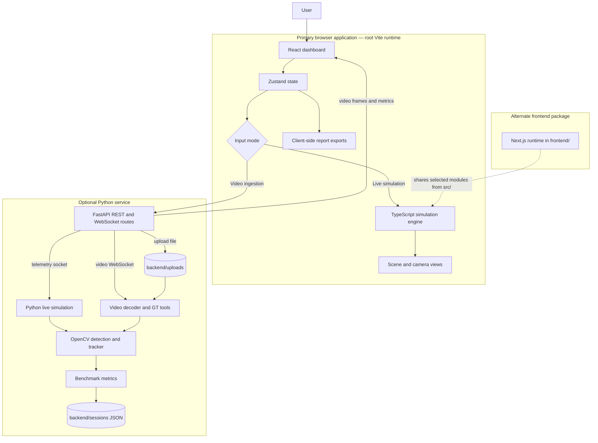
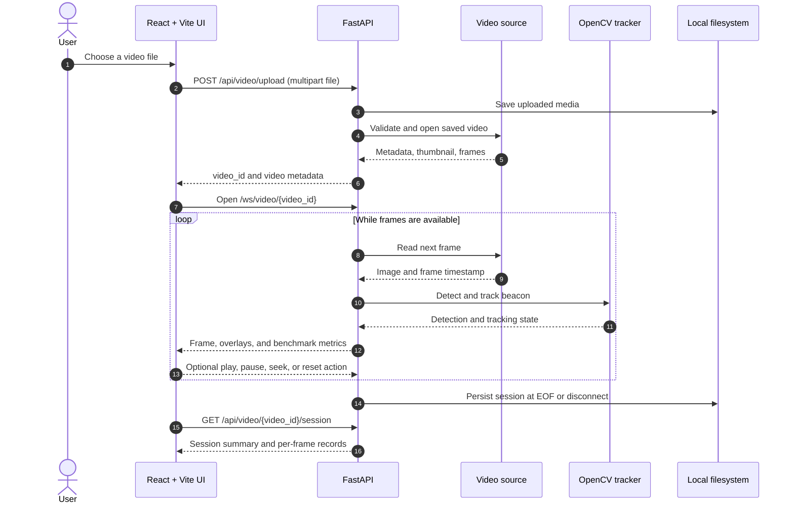
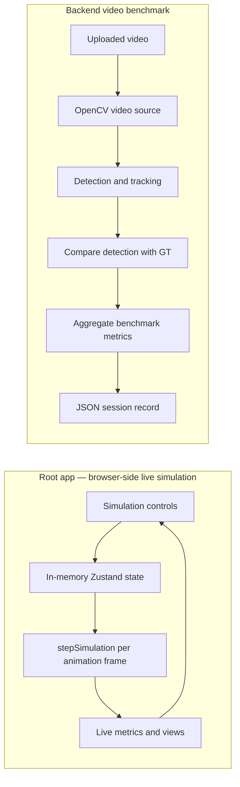

# 🛰️ AI-Based Virtual Camera Tracking System for Coarse Alignment of Mobile FSOC Terminals


> A software testbed for exploring coarse beacon acquisition and camera tracking workflows for free-space optical communication (FSOC). The repository describes this project as an entry for Smart India Hackathon 2024 under the Department of Space / ISRO problem context; this project documentation is not an endorsement or certification by those organizations.

> **Quick start:** run `npm ci` and `npm run dev` from the repository root, then open [http://localhost:3000](http://localhost:3000). The browser-based live simulation does not require the Python backend.

## Contents

- [Overview](#overview)
- [Features](#features)
- [Tech Stack](#tech-stack)
- [Architecture](#architecture)
- [Folder Structure](#folder-structure)
- [Installation](#installation)
- [Environment Variables](#environment-variables)
- [Usage](#usage)
- [API Endpoints](#api-endpoints)
- [Screenshots](#screenshots)
- [Deployment](#deployment)
- [Future Improvements](#future-improvements)
- [Contributors](#contributors)
- [License](#license)

## Overview

FSOC terminals use narrow optical beams and therefore need accurate pointing, acquisition, and tracking (PAT). This project provides a virtual environment for configuring a moving beacon and camera, experimenting with disturbances, visualizing tracking behavior, and evaluating image-based detections against ground truth.

The repository contains **two frontend runtimes** and a **Python backend**:

- The root React + Vite app runs a browser-side live simulation and dashboard.
- The FastAPI service provides a Python simulation/telemetry WebSocket, configuration endpoints, video ingestion, ground-truth tooling, and benchmark-session records.
- A separate Next.js app lives in `frontend/` and shares selected UI and simulation modules from `src/`.

These are related but not a single end-to-end runtime: the root live simulation runs locally in the browser, while backend video evaluation uses the Python tracker. The local video-ingestion UI can use the backend when it is running; its synthetic demo path is generated in the browser and should not be interpreted as measurements from an uploaded video.

## Features

- 🧭 Interactive scene and virtual-camera views with configurable target motion and camera controls.
- 🌦️ Simulation controls for noise, jitter, platform motion, and atmospheric conditions.
- 📊 Live dashboard telemetry and performance visualizations for the browser simulation.
- 🎞️ Video ingestion for `.mp4`, `.avi`, and `.mov` files through the backend, with CSV, manually marked/interpolated, or approximate automatic ground truth.
- 🧪 Python image-processing tracker with blob candidate filtering, Kalman filtering, tracking states, and PID/feed-forward servo control.
- 📈 Video benchmark metrics including centroid error, RMSE, lock retention, target loss, processing time, and FPS.
- 📦 Browser-generated JSON/CSV report downloads and Markdown summary copying.
- 🔁 Seeded, headless Python simulations using JSON scenario configurations.

> Performance thresholds in the UI and configuration are evaluation targets, not guarantees. Results depend on the selected configuration, input data, and runtime; no specific benchmark outcome is claimed here.

## Tech Stack

| Area | Technologies |
| --- | --- |
| Primary UI | React 19, TypeScript, Vite 6, Tailwind CSS, Zustand, Recharts, Lucide |
| Alternate UI | Next.js 14, React 18, TypeScript, Tailwind CSS, Zustand |
| Backend/API | Python, FastAPI, Uvicorn, Pydantic, `python-multipart`, WebSockets |
| Computer vision and numerics | OpenCV (headless), NumPy |
| Streaming | HTTP REST, WebSockets, base64-encoded JPEG frames |
| Local reports and sessions | Browser downloads and JSON files; no database configured |

## Architecture



### Runtime and data flows

The diagrams below distinguish the browser-only live simulation from backend-powered video evaluation. The backend also exposes its own Python simulation telemetry socket; it is an API capability and is not the engine used by the root app's live-simulation loop.





### Runtime boundaries

- `src/App.tsx` drives the primary live simulation with `requestAnimationFrame` and `src/lib/simulationEngine.ts`; this mode does not require the Python server.
- `backend/main.py` exposes REST and WebSocket interfaces. Its live telemetry socket runs the Python simulation/tracker loop; its video socket feeds decoded source frames into the Python tracker.
- The primary UI's video upload request currently targets `http://localhost:8000`. WebSocket clients target port `8000` on the browser page's hostname. These defaults are suitable for local development but require deployment configuration or code changes for a remote backend.
- `frontend/` is a separate Next.js package. It imports shared application modules from `src/`; it is not the root Vite runtime.

### Authentication and persistence

There is **no authentication or authorization** in the current backend. There is **no database or ORM**. Configuration and active video sessions are held in process memory; uploaded media is stored under `backend/uploads/`, and video benchmark records are JSON files under `backend/sessions/`. Browser simulation state is held in Zustand memory, and report exports are generated client-side.

## Folder Structure

```text
SIH26169/
├── src/                         # Primary React + Vite application
│   ├── App.tsx                  # Dashboard and browser simulation loop
│   ├── components/              # Layout, panels, views, and UI controls
│   └── lib/                     # Simulation engine, state store, spec, sockets
├── backend/                     # FastAPI service and Python tracking pipeline
│   ├── main.py                  # REST and WebSocket endpoints
│   ├── simulation.py            # Python simulation and rendering
│   ├── tracker.py, kalman.py    # Detection, tracking, filtering, servo control
│   ├── video_source.py           # Video decoding/input
│   ├── gt_extractor.py           # Ground-truth parsing/interpolation/extraction
│   ├── benchmark.py              # Metrics and JSON session persistence
│   ├── headless.py               # Seeded batch simulation CLI
│   ├── test_phase5.py            # Direct backend smoke-test suite
│   ├── requirements.txt          # Python dependencies
│   ├── uploads/                  # Backend video uploads (created/used at runtime)
│   └── sessions/                 # Backend benchmark JSON records
├── frontend/                    # Alternate Next.js app/runtime
├── configs/                     # Example clean and fog-stress scenarios
├── sessions/                    # Checked-in sample/example session JSON
├── make_test_video.py            # Synthetic video generator
├── package.json                  # Root Vite scripts and dependencies
├── VERSION                       # Repository version marker (0.5.0)
└── README.md
```

## Installation

### Requirements

- Node.js and npm compatible with the root package and lockfile.
- Python with `pip` for the optional backend. A precise supported Python range is not declared in the repository.
- OpenCV's headless wheel is installed from `backend/requirements.txt`.

### 1. Install and run the primary frontend

From the repository root:

```bash
npm ci
npm run dev
```

Open [http://localhost:3000](http://localhost:3000). This starts the Vite app; its live simulation works without the backend.

Available root scripts:

| Command | Purpose |
| --- | --- |
| `npm run dev` | Start Vite on port `3000`, bound to `0.0.0.0` |
| `npm run build` | Create the production frontend bundle in `dist/` |
| `npm run preview` | Preview the built Vite bundle locally |
| `npm run lint` | Run `tsc --noEmit` (TypeScript check) |

### 2. Install and run the backend (optional)

In PowerShell:

```powershell
cd backend
python -m venv .venv
.\.venv\Scripts\Activate.ps1
python -m pip install -r requirements.txt
python main.py
```

In macOS/Linux shells:

```bash
cd backend
python3 -m venv .venv
source .venv/bin/activate
python -m pip install -r requirements.txt
python main.py
```

The backend listens on port `8000`. It enables Uvicorn reload mode when launched with `python main.py`, which is intended for development. With both apps running locally, the UI can attempt backend video upload and connect to video benchmark WebSockets.

### 3. Optional alternate Next.js frontend

The repository also has a separate Next.js runtime:

```bash
cd frontend
npm ci
npm run dev
```

It serves on port `3000` by default. Run it separately from the root Vite app; use a different port if both frontends need to run at once. Production build/start scripts are also declared in `frontend/package.json`.

## Environment Variables

The current application does not require an environment file for its standard local run.

| Variable | Used by | Description |
| --- | --- | --- |
| `DISABLE_HMR` | Root Vite config | Set to `true` to disable Vite HMR and file watching (the config comment describes AI Studio use). Otherwise HMR is enabled. |
| `GEMINI_API_KEY` | `.env.example` only | Listed in the example file, but no current app-source call site was found. It is not required for the documented flows. |
| `APP_URL` | `.env.example` only | Listed in the example file, but no current app-source use was found. It is not required for the documented flows. |

The `.env.example` values should not be treated as evidence that Gemini integration, OAuth callbacks, or configurable API URLs are implemented. The video-upload URL is currently hardcoded in the UI.

## Usage

### Browser simulation

1. Start the root app with `npm run dev` and open it in a browser.
2. Configure the simulation, target trajectory, camera, detection, and disturbances in the dashboard panels.
3. Select the live simulation input mode, then start, pause, step, or reset from the interface.
4. Observe the scene/camera views, telemetry, and performance panels. Use the report panel to download the available JSON/CSV report or copy its Markdown summary.

### Video benchmark with the backend

1. Start the backend in `backend/` and the root Vite app in the repository root.
2. In the dashboard, select video ingestion and choose an `.mp4`, `.avi`, or `.mov` file. The backend accepts videos at least 640×480; it warns when detected FPS is outside 25–35 FPS.
3. If the backend upload succeeds, it registers a video session and estimates approximate ground truth by default. Otherwise, the UI may continue with its client-side preview/synthetic behavior; this is not a backend benchmark run.
4. Select CSV, click-marked/interpolated, or automatic ground truth where available, then play the backend stream and inspect the benchmark metrics.
5. Retrieve the saved backend session through `GET /api/video/{video_id}/session` after processing or completion.

### Headless simulation

From the `backend/` directory, run a deterministic sample scenario and save its JSON result:

```bash
python headless.py --config ../configs/clean.json --seed 42 --duration 30 --out sessions/clean_run.json
```

Use `../configs/fog_stress.json` for the included fog-stress configuration. Output includes a run header, metric summary, and configured-spec validation fields. Measurements are run-specific; compare results from reproducible runs rather than relying on undocumented typical values.

Run the backend's direct smoke checks from `backend/` with:

```bash
python test_phase5.py
```

This file invokes the detection, Kalman, servo-limit, candidate-schema, and tracker-state checks directly; it is not configured as a pytest command. The frontend package includes a test source file but does not currently declare a test script/dependency setup for it.

## API Endpoints

The following endpoints belong to the FastAPI service at `http://localhost:8000`. There is no API authentication.

### REST

| Method | Path | Request | Behavior |
| --- | --- | --- | --- |
| `GET` | `/api/health` | — | Service status, phase, input mode, and configured target FPS. |
| `GET` | `/api/config` | — | Current system configuration as JSON. |
| `POST` | `/api/config` | JSON object containing configuration fields | Applies recognized keys and returns updated configuration. |
| `POST` | `/api/reset` | — | Resets the Python simulation. |
| `GET` | `/api/session/header` | — | Returns master seed, config hash, software version, timestamp, and config metadata. |
| `POST` | `/api/video/upload` | `multipart/form-data`, file field named `file` | Registers a supported video and returns its ID, media metadata, thumbnail, FPS warning, and approximate-GT count. |
| `POST` | `/api/video/{video_id}/gt` | JSON: `{"mode":"csv","csv_text":"..."}`, `{"mode":"click","marked_samples":{"0":[x,y]}}`, or `{"mode":"auto"}` | Replaces ground truth using CSV points, interpolated marked points, or approximate automatic extraction. |
| `GET` | `/api/video/{video_id}/session` | — | Returns a saved benchmark summary and frame records; returns 404 if unavailable. |

### WebSockets

| Endpoint | Direction and payloads |
| --- | --- |
| `ws://localhost:8000/ws/telemetry` | Server streams JSON with a timestamp, base64 JPEG frame, metrics, and targets. Client may send `{"type":"update_spec","payload":{...}}`. |
| `ws://localhost:8000/ws/video/{video_id}` | Server streams frame messages containing frame index, image, detection, optional GT, boresight, approximate-GT flag, and metrics. Client actions include `{"action":"play"}`, `pause`, `reset`, and `{"action":"seek","frame_idx":N}`. The current `step` action pauses the stream; it does not advance one frame. An `eof` message indicates completion. |

For a complete, current contract, see the route and WebSocket handlers in `backend/main.py`.

## Screenshots

Screenshots are not currently included in the repository. Replace these placeholders with captured application images before publishing:

| Preview | Placeholder |
| --- | --- |
| Dashboard | 📸 Add a screenshot showing the scene, camera view, and top-level telemetry. |
| Configuration | 📸 Add a screenshot of target, camera, and disturbance controls. |
| Video benchmark | 📸 Add a screenshot of a backend-processed frame with detection and ground-truth overlays; label synthetic demos clearly. |
| Reports | 📸 Add a screenshot of the performance panels and report-export UI. |

## Deployment

There are no Docker, Compose, cloud deployment, or production server manifests in the repository. A Vite bundle can be built locally with `npm run build` and the resulting `dist/` directory can be served by a static host. The Next.js runtime has its own `build` and `start` scripts.

The Python API can be hosted as an ASGI application (`main:app` from the `backend/` directory), but the current configuration is development-oriented. **Do not expose it publicly unchanged:**

- CORS allows all origins, methods, and headers, and the backend has no authentication or authorization.
- The service binds to `0.0.0.0` when launched directly and stores uploads/session state locally; active sessions are in memory and are not shared across workers.
- No upload-size limits, cleanup policy, or durable database are configured.
- The frontend uses a hardcoded local HTTP upload URL and WebSocket port convention. Configure a same-origin reverse proxy or change the client endpoints before deploying the UI and API on separate hosts. HTTPS deployments also need secure WebSocket (`wss`) and API routing configured.
- Add production CORS allowlists, authentication, upload validation/limits, durable storage, secret management, and an appropriate process manager before public use.

## Future Improvements

- 🔐 Add authentication, authorization, and deployment-safe CORS configuration.
- 🗄️ Introduce durable session/video storage, retention controls, and upload limits.
- 🌐 Make API and WebSocket base URLs configurable for local, staging, and production environments.
- 🧩 Consolidate or clearly distinguish the Vite and Next.js application entry points.
- ✅ Add a maintained automated test setup for backend and frontend, including end-to-end upload/stream coverage.
- ⏯️ Implement true single-frame stepping and improve error/reconnect handling in video streaming.
- 📋 Document reproducible benchmark datasets, methodology, and measured results separately from target thresholds.
- 📦 Add production deployment assets such as container definitions and CI workflows.
- 🏷️ Select one canonical application version and add an explicit project license.

## Contributors

No contributor roster or maintainer contact is declared in the repository. Please open an issue or pull request to discuss changes, and add contributor names/handles here when confirmed by the project maintainers.

## License

No `LICENSE` file is currently present, so no open-source license is declared. Until the project maintainers add a license, do not assume that redistribution or reuse is permitted. Add the chosen license file and update this section before presenting the repository as open source.